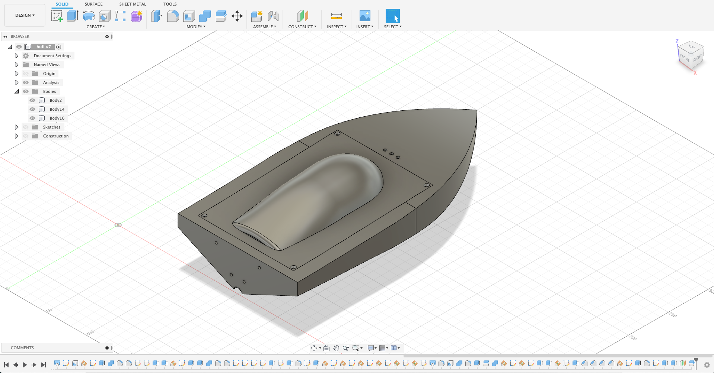
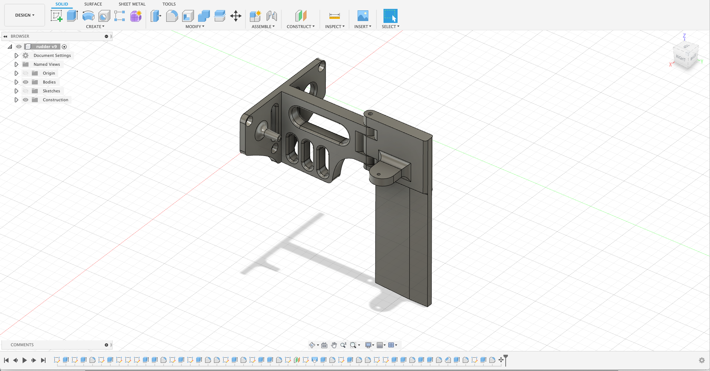

# ESP8266 RC Boat

### Required
* https://github.com/me-no-dev/ESPAsyncWebServer

### 3D Models
* [Thingiverse](https://www.thingiverse.com/thing:4786502)
* [Fusion360 3D models](./models)

### Video
* [Youtube](https://www.youtube.com/watch?v=2OwbVLAE5oU)

### Schema

### Boat

### Mobile UI

